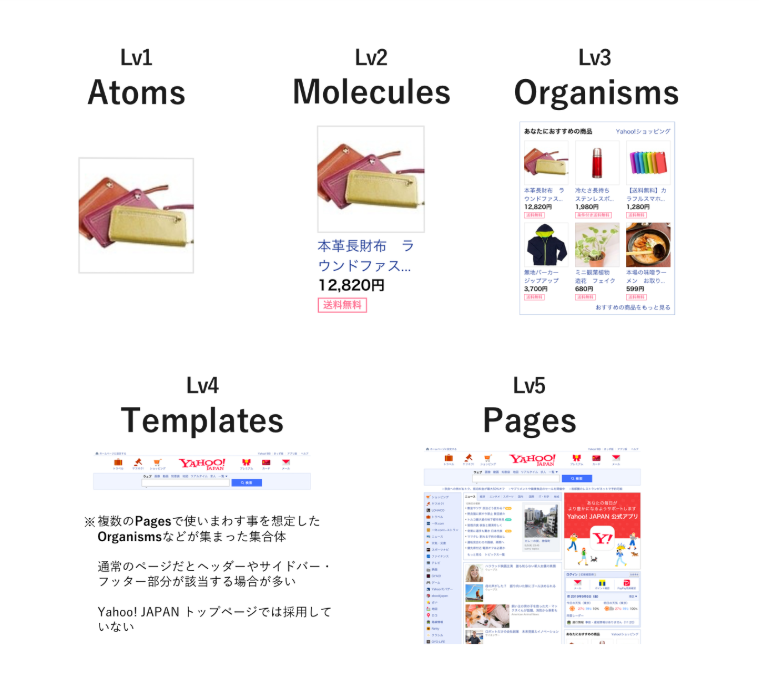
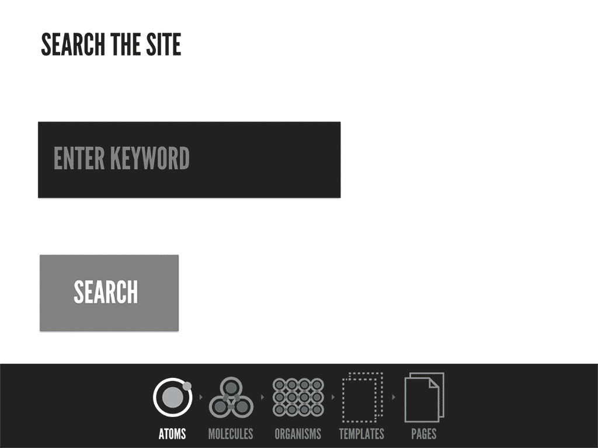

## **AtomicDesign**

* ### Atoms(原子)
  * Atomsには基本的なスタイルだけを指定し、色やpadding、widthなどは変更できるようにつくります。
  例）Button, Icon, Text, Title …
* ### Molecules(分子)
  * Atomsを組み合わせてつくります。
  使っているAtomsの色やpadding、width、marginを指定します。
  しかしMoleculesは汎用的に使うことができるよう、Molecules自体のwidthやmarginなどは（基本的には）ここでは指定しません。
  例）Card, Box, Form, Popup …
* ### Organisms(有機体)
  * AtomsやMoleculesを組み合わせて作ります。
  使っているMoleculesのmarginやwidthはここで指定します。
  Atomsを直接使う場合には色やpadding、width、marginを指定します。
  しかしOrganismsは汎用的に使うことができるよう、Organisms自体のwidthやmarginなどは（基本的には）ここでは指定しません。
  例）Header, Calendar, Modal, CardList …
  * AtomsやMoleculesとの大きな違いは再利用性があまり求められてないと言う点です。
* ### Templates(テンプレート)
  * こちらは中身のないレイアウトのテンプレートです。
  コンテンツの横幅（width）や、サイドバーがあった場合のコンテンツの横幅などが含まれます。
  少し説明しずらいのですが、MainContentsというコンポーネントをつくるとします。
  こちらはコンテンツ幅が810pxで中央寄せになるコンポーネントです。
  このなかにOrganismsを組み合わせていくと、横幅が810pxのコンテンツが出来上がります。
  また、サイドバー250pxとコンテンツ幅600pxのMainContentsWithSideBarをつくるとします。
  このなかにOrganismsを組み合わせていくと、横幅が250pxのサイドバーと横幅が600pxのコンテンツが出来上がります。
  つまり、コンポーネント自体の横幅を指定しなかったことがここで活きてくるのです。
  例）MainContents, MainContentsWithSideBar …
* ### Pages(ページ)
  * これは名前の通りです。これまでのコンポーネントに実際のテキストや画像を流しこみます。
  このページ特有のOrganismsのmarginなどはここで指定します。
  汎用的につくることは意識しません。

## **AtomicDesign image example**

> 
> 
